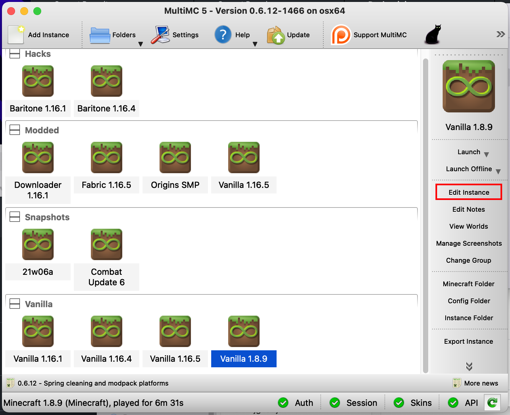

# m1-multimc-hack-1.8

Want to get Minecraft <1.12.2 running natively on a Mac with an M1 "Apple Silicon" chip?

This repo contains a wrapper script to be used with [MultiMC](https://multimc.org) that will configure any MultiMC instance to use the Apple Silicon native libraries from lunar client. All you have to do is set the wrapper command and make sure you're using an M1-compatible JDK, and it should just work.

## Setup and Usage

### Pre-requisites

First, install the [Zulu Java 11 JDK for macOS ARM64](https://cdn.azul.com/zulu/bin/zulu11.43.1015-ca-jdk11.0.9.1-macos_aarch64.dmg).

You'll also need a standard install of MultiMC.

### Clone this repo

Open a terminal (it's in the `Utilities` folder inside of `Applications`, if you're new to command line stuff).

To make it easy to follow along, we'll make a new directory called `Minecraft` in our home folder. If you'd rather put this repo somewhere else, that's fine - the location doesn't really matter. If you do put it somewhere else, remember to change the references to it in the commands below.

The lines beginning with `#` below are comments and don't need to be entered, but it's fine to copy paste them in along with the rest.

```shell
# Make a place to put our wrapper script and libraries
mkdir -p ~/Minecraft

# enter the new directory
cd ~/Minecraft

# clone this repo
git clone https://github.com/yusefnapora/m1-multimc-hack.git
```

### Configure MultiMC

Create a new Minecraft instance in MultiMC (or duplicate an existing one), then click "Edit Instance" in the sidebar.



Go to Settings, then make sure the "Java Installation" checkbox is checked. Then hit "Auto-detect".


It should open a window with a list of Java versions. Find the one that says "zulu-11" in the path and select it, then hit OK. (You may need to resize the window to see the full path.)


Still in the Settings pane, switch to the "Custom Commands" tab. Check the "Custom Commands" checkbox. In the "Wrapper Command" box, enter the full path to the `mcwrap.py` script from this repo, e.g. `/Users/your-username/stuff/m1-multimc-hack/mcwrap.py`.


An easy way to get the full path (assuming you put this repo in `~/Minecraft`) is to open a terminal and enter:

```shell
ls ~/Minecraft/m1-multimc-hack/mcwrap.py | pbcopy
```

This will expand the `~` character to the full path to your home directory (e.g. `/Users/yourname`), and copy the whole thing onto your clipboard using the `pbcopy` command. Now you can paste it into the "Wrapper Command" box.

That's it! You should be able to launch the instance and run with native performance.

### Optional - Mods

Fabric seems to work great, so that's pretty cool :) To install Fabric, go to the Version pane of the "Edit Instance" screen, then just hit "Install Fabric". You can then add Fabric mods from the "Loader Mods" pane.

So far, I haven't had any luck running Forge - I keep hitting LWJGL bugs that crash on launch. Hopefully this will eventually get sorted out, as it seems to affect most Java JDKs, not just native ARM builds. FWIW, if you get Forge crashes on launch using Rosetta, you should try using [Amazon's Corretto build of OpenJDK 8](https://docs.aws.amazon.com/corretto/latest/corretto-8-ug/downloads-list.html), which doesn't seem to be affected and can run Forge, optifine, etc.

## Optional - Global Configuration

The instructions above will enable the native Apple Silicon libs for a single MultiMC instance, but if you want, you can enable them for _all_ instances. Just enable the ARM JDK and set the Wrapper Command in the main MultiMC Settings window instead of the instance settings.

If you do set the configuration globally, you can always change it to an Intel JDK and remove the wrapper command on a per-instance basis, for example if you want to play with Forge mods before compatibility is sorted out.

## Credits

The `mcwrap.py` script was written by Yusef Napora, and is public domain. Please feel free to fork and improve, but expect PRs & issues, etc to be routed to the Sirius Cybernetics Corporation, Complaints Division. [Share and Enjoy!](https://hitchhikers.fandom.com/wiki/Share_and_Enjoy)
